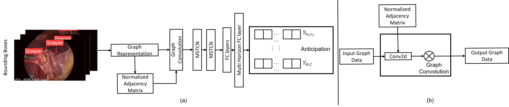

# Towards Graph Representation Learning Based Surgical Workflow Anticipation
Example Code for the paper Towards Graph Representation Learning Based Surgical Workflow Anticipation



## Environment Setup
First please create an appropriate environment using conda: 

> conda env create -f surgery.yaml
> 
> conda activate surgery

## Test Pre-Trained Models
Evaluate on Sample dataset:
> python main_infer.py


## Train a Model
Train on Sample dataset:
> python main.py

In training, our default stream is only based on graph-level information, as we proposed in our paper. 

Additionally, this source code also offers an option to introduce pixel-level information (refering to previous SOTA: https://github.com/Flaick/Surgical-Workflow-Anticipation) into our network to extend our network in different circumstances.

## Citing

If you find this work useful, please consider our paper to cite:

```
@inproceedings{zhang22towards,
 author={Zhang, Xiatian and Moubayed, Noura Al and Shum, Hubert P. H.},
 booktitle={Proceedings of the 2022 IEEE-EMBS International Conference on Biomedical and Health Informatics},
 title={Towards Graph Representation Learning Based Surgery Workflow Anticipation},
 year={2022},
 publisher={IEEE},
 location={Ioannina, Greece},
}
```
